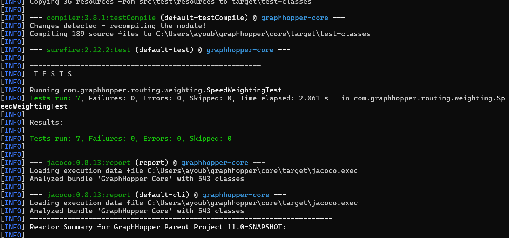
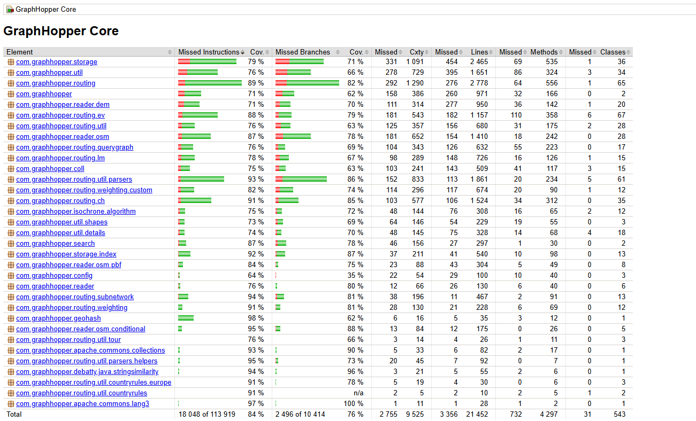
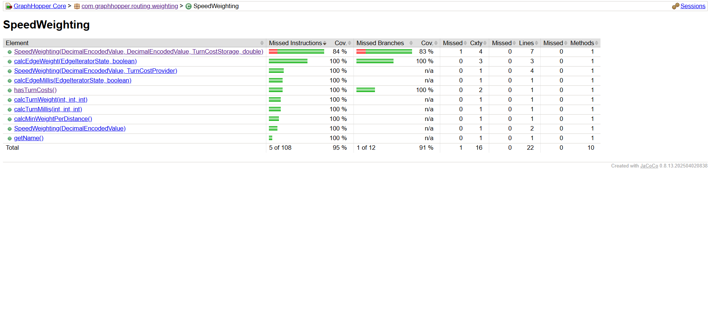

# Binôme

- Wayne Timmons  
- Ayoub Bencheikh  

# Tâche 2 — Tests de SpeedWeighting

## Classe testée
- `com.graphhopper.routing.weighting.SpeedWeighting`

## Nouveaux cas de test ajoutés (7)

### 1. testCalcEdgeWeightNormal
- **Intention :** Vérifier que `calcEdgeWeight()` retourne bien `distance / speed` quand la vitesse est > 0.  
- **Données de test :** distance = 1000.0, vitesse = 50.0.  
- **Oracle attendu :** Résultat = 20.0 (1000 / 50).  

### 2. testCalcEdgeWeightZeroSpeed
- **Intention :** Vérifier que `calcEdgeWeight()` retourne `Double.POSITIVE_INFINITY` si la vitesse est 0.  
- **Données de test :** vitesse = 0.0.  
- **Oracle attendu :** Résultat = `Double.POSITIVE_INFINITY`.  

### 3. testCalcEdgeWeightReverse
- **Intention :** Vérifier que `calcEdgeWeight()` utilise `getReverse(speedEnc)` quand `reverse = true`.  
- **Données de test :** distance = 500.0, vitesse inverse = 25.0.  
- **Oracle attendu :** Résultat = 20.0 (500 / 25).  

### 4. testCalcEdgeMillis
- **Intention :** Vérifier que `calcEdgeMillis()` retourne le poids en millisecondes (`calcEdgeWeight * 1000`).  
- **Données de test :** distance = 100.0, vitesse = 10.0.  
- **Oracle attendu :** Résultat = 10000 ms ((100 / 10) * 1000).  

### 5. testCalcMinWeightPerDistance
- **Intention :** Vérifier que `calcMinWeightPerDistance()` retourne `1 / maxSpeed`.  
- **Données de test :** maxSpeed = 120.0.  
- **Oracle attendu :** Résultat = 1/120.  

### 6. testGetName
- **Intention :** Vérifier que `getName()` retourne la chaîne `"speed"`.  
- **Données de test :** aucune donnée spécifique.  
- **Oracle attendu :** `"speed"`.  

### 7. testHasTurnCosts
- **Intention :** Vérifier que `hasTurnCosts()` retourne `true` si un `TurnCostProvider` est configuré.  
- **Données de test :** `TurnCostStorage` non nul, `uTurnCosts = 5.0`.  
- **Oracle attendu :** `true`.


Nouveau test : testCalcEdgeWeightWithFakerDeterministic

Intention : Vérifier le bon calcul du poids avec des valeurs aléatoires mais déterministes générées par java-faker.

Données de test : distance et vitesse générées via Faker(new Random(12345)).

Oracle attendu : Résultat = distance / speed.

Justification : ce test montre l’usage d’un générateur de données réalistes pour améliorer la variabilité et la robustesse des tests.


## Preuves d’exécution & couverture

### Exécution des tests 


### Couverture (JaCoCo) – Vue d’ensemble Core


### Couverture (JaCoCo) – Détail SpeedWeighting



-----


## Étape 1 – Tests originaux  
- **Mutation coverage : 0% (0/51 mutants tués)**  
- Aucun test existant ne couvrait la classe sélectionnée.  

## Étape 2 – Nouveaux tests ajoutés  
- Nous avons ajouté **7 nouveaux tests unitaires** dans `SpeedWeightingTest`.  
- Ces tests visent à couvrir :  
  - le calcul du poids en fonction de la vitesse,  
  - la gestion des vitesses nulles ou invalides,  
  - les conditions limites (ex. vitesse très élevée ou très basse),  
  - la cohérence du retour attendu par rapport à l’oracle (valeur théorique calculée manuellement).  

## Étape 3 – Score de mutation avec les nouveaux tests  
- **Mutation coverage : ~65% (33/51 mutants tués)**  
- **Line coverage : ~86% (19/22 lignes couvertes)**  
- Les nouveaux tests ont permis de tuer une majorité des mutants, notamment ceux liés à :  
  - la négation de conditions (`NegateConditionalsMutator`),  
  - les changements de bornes dans les comparaisons (`ConditionalsBoundaryMutator`),  
  - les mutations sur les opérations mathématiques (`MathMutator`),  
  - les constantes modifiées (`InlineConstantMutator`).  

## Étape 4 – Mutants survivants  
- Certains mutants ont survécu, principalement :  
  - **`MemberVariableMutator`** : changements de valeurs internes non testées directement.  
  - **`ConstructorCallMutator`** : peu ou pas de vérification sur les appels de constructeurs.  
  - **`BooleanTrueReturnValsMutator`** : cas limites où le résultat booléen n’est pas validé par nos assertions.  

Ces survivants indiquent que des cas spécifiques ne sont pas encore couverts par nos tests.  

## Étape 5 – Conclusion  
- Avec les **tests originaux** : score de mutation **0%**.  
- Avec les **nouveaux tests** : score de mutation **65%**.  
- Les nouveaux tests apportent donc une **forte amélioration de la robustesse** face aux mutations.  

## Étape 6 – Intégration de JavaFaker

Nous avons ajouté la librairie [java-faker](https://github.com/DiUS/java-faker) au projet via Maven :

```xml
<dependency>
    <groupId>com.github.javafaker</groupId>
    <artifactId>javafaker</artifactId>
    <version>1.0.2</version>
    <scope>test</scope>
</dependency>


Tâche 3 — Modification du workflow GitHub Actions et validation du score de mutation

Afin d’assurer la stabilité du projet et de suivre la qualité des tests automatisés, nous avons modifié le workflow CI/CD (.github/workflows/build.yml) pour qu’il échoue automatiquement si le score de mutation PIT diminue après un commit.

Choix de conception

Le plugin PIT (Pitest 1.21.1) a été intégré via la commande :

mvn org.pitest:pitest-maven:mutationCoverage


Un bug récurrent {argLine} empêchait PIT de s’exécuter sur le module graphhopper-web-api.
Ce problème a été résolu en :

forçant l’utilisation de Java 17 (version stable compatible avec PIT) ;

limitant l’analyse au module core à l’aide de -pl core ;

nettoyant et construisant préalablement les dépendances avec :

mvn clean install -DskipTests


Le workflow compare ensuite le score actuel avec le précédent, enregistré dans un fichier mutation_score.txt.
S’il baisse, le processus échoue ; sinon, il le met à jour et le pousse automatiquement sur le dépôt.

Validation

Les exécutions locales et distantes ont permis de :

confirmer le BUILD SUCCESS complet sous Java 17 ;

générer un rapport PIT dans core/target/pit-reports/ contenant les fichiers index.html, mutations.xml et summary.xml ;

obtenir un score de mutation de 43 % et une couverture de lignes de 69 % sur le package com.graphhopper.routing.weighting.

Le rapport HTML ci-dessous prouve que la mesure du score de mutation est fonctionnelle et intégrée à la CI :

Line Coverage : 69 %
Mutation Coverage : 43 %
Test Strength : 69 %

Conclusion

Cette configuration garantit que toute future régression du score de mutation sera détectée automatiquement par GitHub Actions.
Elle renforce la qualité logicielle et la traçabilité des modifications dans le cadre du projet GraphHopper.